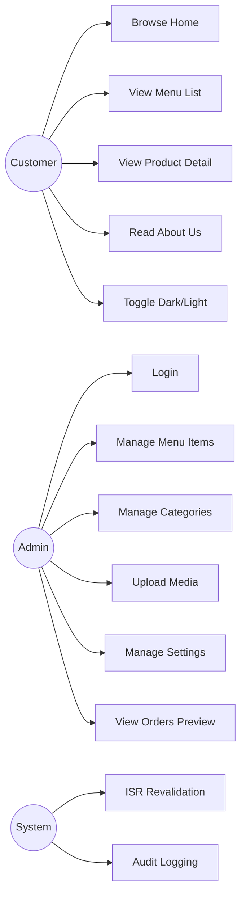
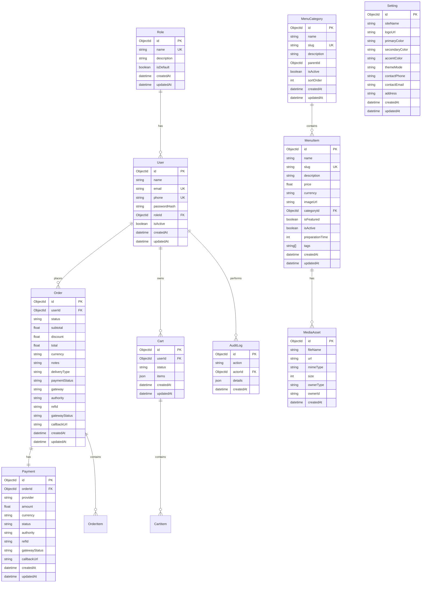
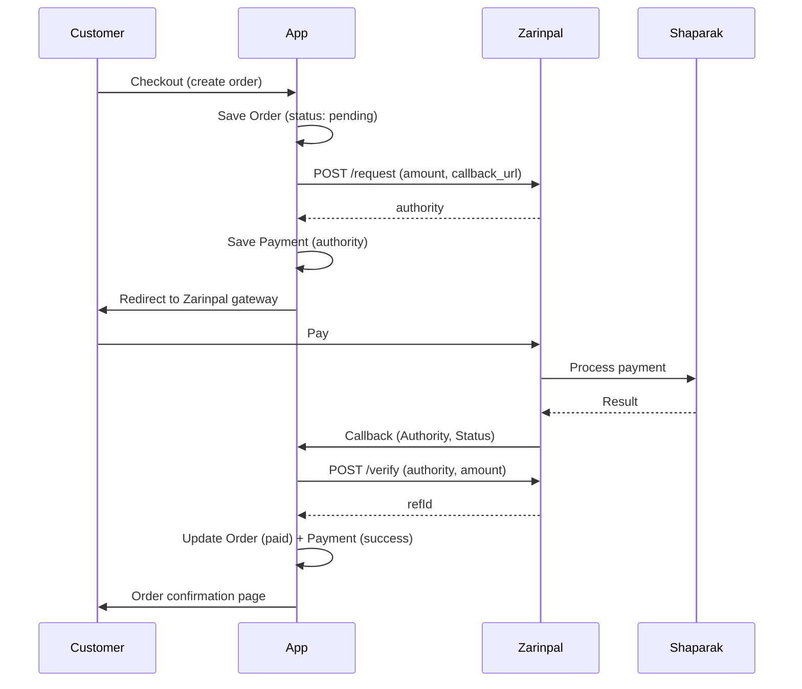
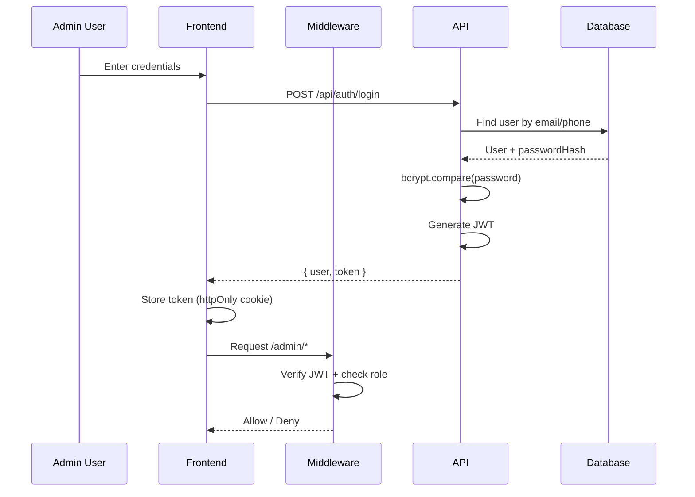

# PRD کامل — Premium Next.js Boilerplate برای منوی کافه‌رستوران

> **نسخه:** 1.0.0  
> **تاریخ:** ۱۷ تیر ۱۴۰۵ (۱۷ جولای ۲۰۲۶)  
> **وضعیت:** Draft — Pending Approval  
> **مرجع Roadmap:** [ROADMAP.md](./ROADMAP.md)

---

## فهرست مطالب

1. [مقدمه و Vision](#1-مقدمه-و-vision)
2. [User Personas](#2-user-personas)
3. [Use Cases](#3-use-cases)
4. [Feature Breakdown](#4-feature-breakdown)
5. [Functional Requirements](#5-functional-requirements)
6. [UI/UX Requirements](#6-uiux-requirements)
7. [Technical Specifications](#7-technical-specifications)
8. [Database Schema و ERD](#8-database-schema-و-erd)
9. [API Endpoints](#9-api-endpoints)
10. [Authentication & Authorization Flow](#10-authentication--authorization-flow)
11. [Performance Requirements](#11-performance-requirements)
12. [Security Requirements](#12-security-requirements)
13. [Non-Functional Requirements](#13-non-functional-requirements)
14. [Acceptance Criteria](#14-acceptance-criteria)
15. [Delivery Phases](#15-delivery-phases)
16. [Appendix](#16-appendix)

---

## 1. مقدمه و Vision

### 1.1 خلاصه محصول

**Premium Boilerplate Menu** یک پلتفرم منوی دیجیتال حرفه‌ای برای کافه‌ها و رستوران‌هاست که:

- به مشتریان امکان **مشاهده سریع و زیبای منو** از طریق QR Code یا لینk مستقیم را می‌دهد
- به مدیران امکان **مدیریت محتوا، قیمت‌ها و تصاویر** از پنل ادمین را می‌دهد
- **زیرساخت آماده** برای سفارش‌گیری، سبد خرید و پرداخت آنلاین (زرین‌پال و…) دارد

### 1.2 Vision

> «ایجاد مرجع‌ترین Boilerplate منوی دیجیتال فارسی‌زبان با کیفیت Global-Level، آماده فروش و توسعه به پلتفرم سفارش‌گیری کامل.»

### 1.3 Goals

| # | Goal | Metric |
|---|---|---|
| G1 | تجربه Premium برای مشتری | Lighthouse ≥ 90 |
| G2 | پنل ادمین کارآمد | CRUD < 30s per item |
| G3 | SEO و discoverability | SEO score ≥ 90 |
| G4 | Future-ready architecture | Schema covers Order/Cart/Payment |
| G5 | Sale-ready quality | Zero critical bugs at launch |

### 1.4 Non-Goals (MVP)

- ❌ پرداخت آنلاین واقعی
- ❌ سبد خرید و Checkout کامل
- ❌ OTP و Social Login
- ❌ RBAC چندنقشی (SuperAdmin/Manager/Staff)
- ❌ Multi-tenant SaaS
- ❌ POS Integration
- ❌ Push notifications
- ❌ Native mobile app

### 1.5 Stakeholders

| Stakeholder | نقش | Interest |
|---|---|---|
| Restaurant Owner | خریدار Boilerplate | branding, easy management |
| Developer (Buyer) | پیاده‌ساز | clean code, extensibility |
| End Customer | کاربر نهایی | fast menu browsing |
| Admin User | مدیر محتوا | CRUD, upload, settings |

---

## 2. User Personas

### 2.1 Persona 1: «رضا» — صاحب کافه (Restaurant Owner)

| Attribute | Detail |
|---|---|
| سن | ۳۵–۵۰ |
| نقش | مالک/مدیر کافه |
| تکنولوژی | متوسط (اسmartphone، Instagram) |
| Pain Points | منوی چاپی گران، آپدیت سخت، برند ضعیف |
| Goals | منوی دیجیتال زیبا، کنترل قیمت، برند حرفه‌ای |
| Scenario | QR روی میز → مشتری منو می‌بیند → رضا از پنل قیمت عوض می‌کند |

### 2.2 Persona 2: «سارا» — ادمین محتوا (Admin)

| Attribute | Detail |
|---|---|
| سن | ۲۵–۳۵ |
| نقش | Admin (تنها نقش MVP) |
| تکنولوژی | بالا |
| Pain Points | پنل‌های پیچیده، upload سخت، بدون preview |
| Goals | CRUD سریع، upload آسان، preview تغییرات |
| Scenario | آیتم جدید اضافه → تصویر upload → publish → مشتری می‌بیند |

### 2.3 Persona 3: «علی» — مشتری (Customer/Visitor)

| Attribute | Detail |
|---|---|
| سن | ۱۸–۴۵ |
| نقش | بازدیدکننده / مشتری کافه |
| تکنولوژی | بالا (mobile-first) |
| Pain Points | PDF منو، load کند، UI قدیمی |
| Goals | منوی سریع، تصاویر زیبا، جستجو آسان |
| Scenario | QR scan → browse categories → detail → (future: order) |

### 2.4 Persona 4: «مریم» — مدیر سالن (Manager) — Future

| Attribute | Detail |
|---|---|
| سن | ۲۸–۴۰ |
| نقش | Manager (فاز بعد) |
| Goals | مشاهده سفارش‌ها، تغییر وضعیت، گزارش فروش |
| Access | Orders + Menu (read), Settings (read) |

### 2.5 Persona 5: «حسین» — گارسون (Staff) — Future

| Attribute | Detail |
|---|---|
| سن | ۲۰–۳۰ |
| نقش | Staff (فاز بعد) |
| Goals | مشاهده سفارش‌های فعال، تغییر status |
| Access | Orders (read/update status only) |

---

## 3. Use Cases

### 3.1 Use Case Diagram (Conceptual)



### 3.2 Use Cases تفصیلی

#### UC-01: مشاهده صفحه اصلی

| Field | Value |
|---|---|
| Actor | Customer |
| Precondition | — |
| Flow | 1. کاربر URL/QR را باز می‌کند → 2. Hero + featured items نمایش → 3. CTA به List/About |
| Postcondition | SEO metadata loaded |
| Priority | P0 |

#### UC-02: مرور فهرست منو

| Field | Value |
|---|---|
| Actor | Customer |
| Precondition | — |
| Flow | 1. ورود به /list → 2. دسته‌بندی‌ها → 3. فیلتر/جستجو → 4. کلیک روی item |
| Postcondition | Navigate to product detail |
| Priority | P0 |

#### UC-03: مشاهده جزئیات محصول

| Field | Value |
|---|---|
| Actor | Customer |
| Precondition | Item exists and isActive |
| Flow | 1. ورود به /product/[slug] → 2. تصویر، قیمت، توضیحات، tags |
| Alternative | Item not found → 404 |
| Priority | P0 |

#### UC-04: ورود ادمین

| Field | Value |
|---|---|
| Actor | Admin |
| Precondition | Account exists, isActive |
| Flow | 1. /admin/login → 2. email/mobile + password → 3. JWT issued → 4. redirect /admin |
| Alternative | Invalid credentials → error toast |
| Priority | P0 |

#### UC-05: مدیریت آیتم منو (CRUD)

| Field | Value |
|---|---|
| Actor | Admin |
| Precondition | Authenticated as Admin |
| Flow | Create/Read/Update/Delete menu items with validation |
| Postcondition | ISR revalidation triggered |
| Priority | P0 |

#### UC-06: آپلود تصویر

| Field | Value |
|---|---|
| Actor | Admin |
| Precondition | Authenticated, Cloudinary configured |
| Flow | 1. Select file → 2. Upload to Cloudinary → 3. URL saved to item |
| Alternative | Upload fail → manual URL input |
| Priority | P1 |

#### UC-07: تغییر تنظیمات برند

| Field | Value |
|---|---|
| Actor | Admin |
| Flow | Update siteName, colors, contact, logo |
| Postcondition | Settings reflected in public pages |
| Priority | P1 |

#### UC-08: مشاهده سفارش‌ها (Preview) — Future-ready

| Field | Value |
|---|---|
| Actor | Admin |
| Flow | View order list with status (read-only in MVP) |
| Priority | P2 |

---

## 4. Feature Breakdown

### 4.1 Public Features

| ID | Feature | Priority | Phase | Status |
|---|---|---|---|---|
| PF-01 | Home Page (Hero, Featured, CTA) | P0 | F2 | 🟡 In Progress |
| PF-02 | About Us Page | P0 | F2 | 🟡 In Progress |
| PF-03 | Menu List (categories, grid) | P0 | F2 | 🟡 In Progress |
| PF-04 | Product Detail Page | P0 | F2 | 🟡 In Progress |
| PF-05 | Search & Filter | P1 | F2 | ⬜ Pending |
| PF-06 | Dark/Light Mode Toggle | P0 | F1 | 🟢 Done |
| PF-07 | SEO Metadata + OG | P0 | F2 | ⬜ Pending |
| PF-08 | JSON-LD Structured Data | P1 | F2 | ⬜ Pending |
| PF-09 | 404 Page | P1 | F2 | 🟢 Done |
| PF-10 | Responsive Design | P0 | F2 | 🟡 In Progress |

### 4.2 Admin Features

| ID | Feature | Priority | Phase | Status |
|---|---|---|---|---|
| AF-01 | Login (email/mobile + password) | P0 | F1 | 🟢 Done |
| AF-02 | Protected Routes (middleware) | P0 | F1 | 🟢 Done |
| AF-03 | Dashboard Overview | P0 | F3 | 🟡 In Progress |
| AF-04 | Menu Items CRUD | P0 | F3 | 🟡 In Progress |
| AF-05 | Categories CRUD | P0 | F3 | ⬜ Pending |
| AF-06 | Media Upload (Cloudinary) | P1 | F3 | ⬜ Pending |
| AF-07 | Settings Management | P1 | F3 | 🟡 In Progress |
| AF-08 | Users Management | P2 | F3 | 🟡 In Progress |
| AF-09 | Orders Preview (read-only) | P2 | F3 | 🟡 In Progress |
| AF-10 | Audit Log | P2 | F3 | ⬜ Pending |
| AF-11 | Toast Notifications | P1 | F3 | ⬜ Pending |

### 4.3 Future Features (Post-MVP)

| ID | Feature | Phase |
|---|---|---|
| FF-01 | Shopping Cart UI | F6 |
| FF-02 | Checkout Flow | F6 |
| FF-03 | Zarinpal Payment (production) | F7 |
| FF-04 | Order Status Tracking | F6 |
| FF-05 | RBAC: SuperAdmin/Manager/Staff | F8 |
| FF-06 | Analytics Dashboard | F9 |
| FF-07 | Multi-language Menu | F9 |
| FF-08 | QR Code Generator | F9 |
| FF-09 | Multi-location Support | F9 |
| FF-10 | SaaS Multi-tenant | F10 |

---

## 5. Functional Requirements

### 5.1 Public Requirements

| ID | Requirement | Priority |
|---|---|---|
| FR-P01 | صفحات عمومی بدون authentication قابل دسترسی باشند | P0 |
| FR-P02 | منو از database خوانده شود (Prisma) | P0 |
| FR-P03 | آیتم‌های inactive نمایش داده نشوند | P0 |
| FR-P04 | قیمت با فرمت فارسی (تومان/ریال) نمایش داده شود | P0 |
| FR-P05 | تصاویر با next/image optimize شوند | P0 |
| FR-P06 | Dark/Light mode بدون flicker | P0 |
| FR-P07 | صفحات SSG/ISR با revalidation مناسب | P0 |
| FR-P08 | Metadata دینامیک برای هر product | P1 |
| FR-P09 | جستجو client-side در List page | P1 |

### 5.2 Admin Requirements

| ID | Requirement | Priority |
|---|---|---|
| FR-A01 | فقط Admin authenticated به /admin دسترسی داشته باشد | P0 |
| FR-A02 | Login با email **یا** mobile + password | P0 |
| FR-A03 | Password با bcrypt hash شود (cost ≥ 12) | P0 |
| FR-A04 | CRUD menu items با Zod validation | P0 |
| FR-A05 | Slug unique و auto-generated | P0 |
| FR-A06 | Upload تصویر به Cloudinary | P1 |
| FR-A07 | Settings ذخیره در DB | P1 |
| FR-A08 | Admin actions در AuditLog ثبت شود | P2 |
| FR-A09 | پس از تغییر محتوا، ISR revalidate شود | P1 |
| FR-A10 | Confirmation dialog برای delete | P1 |

### 5.3 Data Requirements

| ID | Requirement | Priority |
|---|---|---|
| FR-D01 | همه models در Prisma schema تعریف شوند | P0 |
| FR-D02 | Order/Cart/Payment models از MVP موجود باشند | P0 |
| FR-D03 | فیلدهای authority, refId, gatewayStatus در Order/Payment | P0 |
| FR-D04 | Role model extensible برای RBAC آینده | P0 |
| FR-D05 | Seed data برای demo | P1 |

---

## 6. UI/UX Requirements

### 6.1 Visual Direction

| Element | Specification |
|---|---|
| Style | Modern, spacious, premium, brand-forward |
| Primary Color | `#2f6b4f` (سبز درباری) |
| Secondary Color | `#8b233d` (زرشکی) |
| Accent Color | `#f4e3b2` (کرم روشن) |
| Surface (Light) | `#faf8f4` |
| Surface (Dark) | `#1a1f1c` |
| Border Radius | `rounded-xl` to `rounded-[2rem]` for cards |
| Shadow | Soft, colored shadows (brand-tinted) |

### 6.2 Typography

| Element | Font | Size | Weight |
|---|---|---|---|
| H1 | Vazirmatn | 2.5–3rem | 600–700 |
| H2 | Vazirmatn | 2rem | 600 |
| H3 | Vazirmatn | 1.5rem | 600 |
| Body | Vazirmatn | 1rem | 400 |
| Caption | Vazirmatn | 0.875rem | 400 |
| Price | Vazirmatn | 1.125rem | 600 |

### 6.3 Design Principles

1. **Mobile-first** — ۷۰%+ traffic از موبایل
2. **Minimal but premium** — فضای سفید کافی، نه شلوغ
3. **Consistent component system** — shadcn/ui tokens
4. **Accessible contrast** — WCAG 2.1 AA minimum
5. **Predictable interactions** — hover, focus, active states
6. **RTL-native** — logical properties, Vazirmatn

### 6.4 Page Layouts

#### Home
```
┌─────────────────────────────────┐
│ Header (logo, nav, theme toggle)│
├─────────────────────────────────┤
│ Hero Section (gradient, CTA)    │
├─────────────────────────────────┤
│ Featured Items (3-col grid)     │
├─────────────────────────────────┤
│ Highlights / Value Props        │
├─────────────────────────────────┤
│ Footer                          │
└─────────────────────────────────┘
```

#### List
```
┌─────────────────────────────────┐
│ Header                          │
├─────────────────────────────────┤
│ Category Tabs (sticky)          │
├─────────────────────────────────┤
│ Search Bar                      │
├─────────────────────────────────┤
│ Menu Grid (2-col mobile, 3 desktop)│
├─────────────────────────────────┤
│ Footer                          │
└─────────────────────────────────┘
```

#### Admin
```
┌──────┬──────────────────────────┐
│ Side │ Top Bar (user, logout)   │
│ bar  ├──────────────────────────┤
│ Nav  │ Content Area             │
│      │ (tables, forms, cards)   │
└──────┴──────────────────────────┘
```

### 6.5 Component Standards

| Component | Base | Variants |
|---|---|---|
| Button | shadcn Button | default, outline, ghost, destructive |
| Card | shadcn Card | default, featured (brand shadow) |
| Input | shadcn Input | default, error state |
| SectionHeading | custom | with subtitle, with action |
| MenuItemCard | custom | grid, list, featured |
| ThemeToggle | custom | sun/moon icon |

### 6.6 Accessibility

- Keyboard navigation for all interactive elements
- Focus visible rings
- ARIA labels on icon-only buttons
- Color contrast ≥ 4.5:1 for text
- Screen reader friendly headings hierarchy
- Skip to content link

---

## 7. Technical Specifications

### 7.1 Stack

```yaml
frontend:
  framework: Next.js 16.2.x
  react: 19.x
  compiler: React Compiler (babel-plugin-react-compiler)
  language: TypeScript 5.x (strict)
  styling: Tailwind CSS 4.x
  ui: shadcn/ui + Radix UI
  state: Zustand 5.x
  http: Axios 1.x
  forms: react-hook-form + Zod 4.x
  themes: next-themes

backend:
  runtime: Next.js Route Handlers
  orm: Prisma 7.x
  database: MongoDB
  auth: JWT (MVP)
  media: Cloudinary (primary) / S3 (alternative)

devops:
  hosting: Vercel (recommended) / Docker
  ci: GitHub Actions
  monitoring: Sentry (optional)
```

### 7.2 Project Structure

```
premium-boilerplate-menu/
├── prisma/
│   ├── schema.prisma
│   └── seed.ts
├── public/
│   └── assets/
├── src/
│   ├── app/
│   │   ├── layout.tsx          # Root layout (font, theme, header)
│   │   ├── page.tsx            # Home
│   │   ├── about/page.tsx
│   │   ├── list/page.tsx
│   │   ├── product/[slug]/page.tsx
│   │   ├── admin/
│   │   │   ├── layout.tsx
│   │   │   ├── page.tsx        # Dashboard
│   │   │   ├── login/page.tsx
│   │   │   ├── menu/page.tsx
│   │   │   ├── orders/page.tsx
│   │   │   ├── settings/page.tsx
│   │   │   └── users/page.tsx
│   │   └── api/
│   │       ├── auth/login/route.ts
│   │       ├── health/route.ts
│   │       ├── menu/
│   │       ├── admin/
│   │       ├── orders/
│   │       ├── cart/
│   │       └── payments/
│   ├── components/
│   │   ├── ui/                 # shadcn primitives
│   │   ├── site-header.tsx
│   │   ├── theme-provider.tsx
│   │   └── theme-toggle.tsx
│   ├── lib/
│   │   ├── auth.ts
│   │   ├── env.ts
│   │   ├── http.ts
│   │   └── utils.ts
│   ├── server/
│   │   ├── prisma.ts
│   │   └── payment/            # payment adapters (future)
│   ├── store/
│   │   ├── auth-store.ts
│   │   └── ui-store.ts
│   ├── types/
│   │   └── index.ts
│   └── data/
│       └── menu.ts             # fallback/seed data
├── .env.example
├── next.config.ts
├── ROADMAP.md
└── PRD.md
```

### 7.3 Environment Variables

| Variable | Required | Description |
|---|---|---|
| `DATABASE_URL` | ✅ | MongoDB connection string |
| `JWT_SECRET` | ✅ | Secret for JWT signing |
| `NEXTAUTH_SECRET` | ✅ | Auth secret (future Auth.js) |
| `NEXTAUTH_URL` | ✅ | App URL |
| `CLOUDINARY_CLOUD_NAME` | ⚠️ | Cloudinary cloud name |
| `CLOUDINARY_API_KEY` | ⚠️ | Cloudinary API key |
| `CLOUDINARY_API_SECRET` | ⚠️ | Cloudinary API secret |
| `ZARINPAL_MERCHANT_ID` | ❌ | Future: payment gateway |
| `ZARINPAL_SANDBOX` | ❌ | Future: sandbox mode |

### 7.4 Rendering Strategy

| Page | Method | `revalidate` | Data Source |
|---|---|---|---|
| `/` | SSG + ISR | 3600 | Prisma + static |
| `/about` | SSG | — | Static + Settings |
| `/list` | ISR | 300 | Prisma MenuCategory + MenuItem |
| `/product/[slug]` | ISR | 300 | Prisma MenuItem |
| `/admin/*` | CSR | — | API calls |
| `/admin/login` | CSR | — | — |

### 7.5 Error Handling

```typescript
// Standard API error response
interface ApiError {
  error: string;      // Human-readable message
  code: string;       // Machine-readable code (e.g., "AUTH_INVALID")
  details?: unknown;  // Optional validation details
}
```

### 7.6 Naming Conventions

| Entity | Convention | Example |
|---|---|---|
| Files (components) | kebab-case.tsx | `menu-item-card.tsx` |
| Files (utils) | kebab-case.ts | `format-price.ts` |
| Components | PascalCase | `MenuItemCard` |
| Functions | camelCase | `formatPrice` |
| Constants | UPPER_SNAKE | `ORDER_STATUS_PENDING` |
| API routes | kebab-case | `/api/menu/items` |
| Prisma models | PascalCase | `MenuItem` |
| DB collections | snake_case | `menu_items` |

---

## 8. Database Schema و ERD

### 8.1 Entity Relationship Diagram



### 8.2 Model Details

#### User

| Field | Type | Constraints | Description |
|---|---|---|---|
| id | ObjectId | PK, auto | شناسه یکتا |
| name | String | required | نام نمایشی |
| email | String | unique, required | ایمیل |
| phone | String | unique, optional | موبایل |
| passwordHash | String | required | bcrypt hash |
| roleId | ObjectId | FK → Role | نقش کاربر |
| isActive | Boolean | default: true | فعال/غیرفعال |
| createdAt | DateTime | auto | — |
| updatedAt | DateTime | auto | — |

#### Role

| Field | Type | Constraints | Description |
|---|---|---|---|
| id | ObjectId | PK | — |
| name | String | unique | `admin`, `super_admin`, `manager`, `staff` |
| description | String | optional | — |
| isDefault | Boolean | default: false | نقش پیش‌فرض |

**MVP Roles:** `admin`  
**Future Roles:** `super_admin`, `manager`, `staff`

#### MenuItem

| Field | Type | Constraints | Description |
|---|---|---|---|
| id | ObjectId | PK | — |
| name | String | required | نام آیتم |
| slug | String | unique | URL-friendly |
| description | String | optional | توضیحات |
| price | Float | required, ≥ 0 | قیمت |
| currency | String | default: "IRR" | واحد پول |
| imageUrl | String | optional | URL تصویر |
| categoryId | ObjectId | FK | دسته‌بندی |
| isFeatured | Boolean | default: false | ویژه |
| isActive | Boolean | default: true | فعال |
| preparationTime | Int | optional | زمان آماده‌سازی (دقیقه) |
| tags | String[] | optional | برچسب‌ها (vegetarian, spicy, …) |

#### Order (Future-ready)

| Field | Type | Description |
|---|---|---|
| status | String | `pending`, `confirmed`, `preparing`, `ready`, `delivered`, `cancelled` |
| deliveryType | String | `dine_in`, `takeaway`, `delivery` |
| paymentStatus | String | `pending`, `paid`, `failed`, `refunded` |
| gateway | String | `zarinpal`, `idpay`, `sep` |
| authority | String | 36-char Zarinpal authority |
| refId | String | Tracking code after verify |
| gatewayStatus | String | `OK`, `NOK` (callback Status) |
| callbackUrl | String | Return URL after payment |

#### Payment (Future-ready)

| Field | Type | Description |
|---|---|---|
| provider | String | `zarinpal` (default) |
| amount | Float | مبلغ (IRR) |
| status | String | `pending`, `success`, `failed` |
| authority | String | Authority from request |
| refId | String | RefID from verify |
| gatewayStatus | String | Callback status |
| callbackUrl | String | Callback endpoint |

### 8.3 Status Enums (Constants)

```typescript
// Order Status Lifecycle
const ORDER_STATUS = {
  PENDING: 'pending',
  CONFIRMED: 'confirmed',
  PREPARING: 'preparing',
  READY: 'ready',
  DELIVERED: 'delivered',
  CANCELLED: 'cancelled',
} as const;

// Payment Status
const PAYMENT_STATUS = {
  PENDING: 'pending',
  PAID: 'paid',
  FAILED: 'failed',
  REFUNDED: 'refunded',
} as const;

// Gateway Status (Shaparak/Zarinpal callback)
const GATEWAY_STATUS = {
  OK: 'OK',
  NOK: 'NOK',
} as const;
```

### 8.4 Indexes (Recommended)

```prisma
// MenuItem
@@index([categoryId])
@@index([isActive, isFeatured])
@@index([slug])

// Order
@@index([userId])
@@index([status])
@@index([paymentStatus])
@@index([authority])

// AuditLog
@@index([actorId])
@@index([createdAt])
```

---

## 9. API Endpoints

### 9.1 Public APIs

| Method | Endpoint | Description | Auth | Response |
|---|---|---|---|---|
| GET | `/api/health` | Health check | ❌ | `{ status: "ok" }` |
| GET | `/api/menu/categories` | List categories | ❌ | `MenuCategory[]` |
| GET | `/api/menu/items` | List items (with filters) | ❌ | `MenuItem[]` |
| GET | `/api/menu/items/[slug]` | Item by slug | ❌ | `MenuItem` |
| GET | `/api/settings` | Public settings | ❌ | `Setting` |

**Query Parameters for `/api/menu/items`:**

| Param | Type | Description |
|---|---|---|
| category | string | Filter by category slug |
| featured | boolean | Only featured items |
| search | string | Search in name/description |
| limit | number | Pagination limit |
| offset | number | Pagination offset |

### 9.2 Auth APIs

| Method | Endpoint | Description | Auth | Body |
|---|---|---|---|---|
| POST | `/api/auth/login` | Admin login | ❌ | `{ identifier, password }` |
| POST | `/api/auth/logout` | Logout | ✅ | — |
| GET | `/api/auth/me` | Current user | ✅ | — |

**Login Request:**
```json
{
  "identifier": "admin@example.com",  // email or phone
  "password": "securePassword123"
}
```

**Login Response:**
```json
{
  "user": {
    "id": "...",
    "name": "Admin",
    "email": "admin@example.com",
    "role": "admin"
  },
  "token": "eyJ..."
}
```

### 9.3 Admin APIs

| Method | Endpoint | Description | Auth | Role |
|---|---|---|---|---|
| GET | `/api/admin/dashboard` | Dashboard stats | ✅ | Admin |
| GET | `/api/admin/menu/items` | List all items | ✅ | Admin |
| POST | `/api/admin/menu/items` | Create item | ✅ | Admin |
| PUT | `/api/admin/menu/items/[id]` | Update item | ✅ | Admin |
| DELETE | `/api/admin/menu/items/[id]` | Delete item | ✅ | Admin |
| GET | `/api/admin/categories` | List categories | ✅ | Admin |
| POST | `/api/admin/categories` | Create category | ✅ | Admin |
| PUT | `/api/admin/categories/[id]` | Update category | ✅ | Admin |
| DELETE | `/api/admin/categories/[id]` | Delete category | ✅ | Admin |
| POST | `/api/admin/media/upload` | Upload file | ✅ | Admin |
| GET | `/api/admin/settings` | Get settings | ✅ | Admin |
| PUT | `/api/admin/settings` | Update settings | ✅ | Admin |
| GET | `/api/admin/users` | List users | ✅ | Admin |
| POST | `/api/admin/users` | Create user | ✅ | Admin |
| GET | `/api/admin/orders` | List orders | ✅ | Admin |
| POST | `/api/admin/revalidate` | Trigger ISR | ✅ | Admin |

### 9.4 Future APIs (Commerce)

| Method | Endpoint | Description | Phase |
|---|---|---|---|
| GET | `/api/cart` | Get current cart | F6 |
| POST | `/api/cart/items` | Add to cart | F6 |
| PUT | `/api/cart/items/[id]` | Update quantity | F6 |
| DELETE | `/api/cart/items/[id]` | Remove from cart | F6 |
| POST | `/api/orders` | Create order | F6 |
| GET | `/api/orders/[id]` | Get order | F6 |
| PATCH | `/api/orders/[id]/status` | Update status | F6 |
| POST | `/api/payments/initiate` | Start payment | F7 |
| GET | `/api/payments/callback` | Payment callback | F7 |
| POST | `/api/payments/verify` | Verify payment | F7 |

### 9.5 Payment Flow (Future — Zarinpal)



---

## 10. Authentication & Authorization Flow

### 10.1 Authentication Flow (MVP)



### 10.2 JWT Payload

```typescript
interface JwtPayload {
  sub: string;      // user id
  email: string;
  role: string;     // role name
  iat: number;
  exp: number;      // 24h default
}
```

### 10.3 Authorization Matrix (MVP)

| Resource | Admin | Public |
|---|---|---|
| View menu | ✅ | ✅ |
| Manage menu | ✅ | ❌ |
| Manage settings | ✅ | ❌ |
| Manage users | ✅ | ❌ |
| View orders | ✅ (read-only) | ❌ |
| Place orders | ❌ (future) | ❌ (future) |

### 10.4 Authorization Matrix (Future)

| Resource | SuperAdmin | Manager | Staff | Customer |
|---|---|---|---|---|
| Manage menu | ✅ | ✅ | ❌ | ❌ |
| Manage settings | ✅ | ❌ | ❌ | ❌ |
| Manage users | ✅ | ❌ | ❌ | ❌ |
| View orders | ✅ | ✅ | ✅ | Own only |
| Update order status | ✅ | ✅ | ✅ | ❌ |
| Place orders | ✅ | ✅ | ✅ | ✅ |
| Process payments | ✅ | ✅ | ❌ | ✅ |

### 10.5 Middleware Logic

```typescript
// src/middleware.ts (conceptual)
const publicPaths = ['/', '/about', '/list', '/product', '/admin/login'];
const adminPaths = ['/admin'];

if (adminPaths.some(p => pathname.startsWith(p))) {
  if (pathname === '/admin/login') return next();
  const token = getToken(request);
  if (!token || !verifyToken(token)) {
    return redirect('/admin/login');
  }
  if (!hasRole(token, 'admin')) {
    return redirect('/admin/login?error=unauthorized');
  }
}
```

---

## 11. Performance Requirements

### 11.1 Core Web Vitals Targets

| Metric | Target | Measurement |
|---|---|---|
| LCP (Largest Contentful Paint) | < 2.5s | Lighthouse / CrUX |
| FID / INP | < 200ms | Lighthouse |
| CLS (Cumulative Layout Shift) | < 0.1 | Lighthouse |
| TTFB (Time to First Byte) | < 800ms | WebPageTest |
| FCP (First Contentful Paint) | < 1.8s | Lighthouse |

### 11.2 Lighthouse Targets

| Category | Target |
|---|---|
| Performance | ≥ 90 |
| Accessibility | ≥ 90 |
| Best Practices | ≥ 90 |
| SEO | ≥ 90 |

### 11.3 Optimization Strategies

| Strategy | Implementation |
|---|---|
| Static Generation | SSG for About, ISR for Home/List/Product |
| Image Optimization | next/image + Cloudinary transforms |
| Font Optimization | next/font with Vazirmatn, display: swap |
| Code Splitting | Dynamic imports for admin components |
| Caching | ISR revalidate + CDN headers |
| Bundle Size | Tree shaking, analyze with @next/bundle-analyzer |
| Database | Prisma query optimization, indexes |

### 11.4 Caching Strategy

| Resource | Cache | Duration |
|---|---|---|
| Static pages (SSG) | CDN | Until rebuild |
| ISR pages | CDN + revalidate | 300–3600s |
| API responses | None (dynamic) | — |
| Images | CDN | 1 year (immutable) |
| Fonts | CDN | 1 year |

---

## 12. Security Requirements

### 12.1 Authentication Security

| Requirement | Implementation |
|---|---|
| Password hashing | bcrypt, cost ≥ 12 |
| JWT signing | HS256 with strong secret (≥ 256 bit) |
| Token storage | httpOnly cookie (preferred) |
| Token expiry | 24h access, 7d refresh (future) |
| Rate limiting | 5 attempts/min on login |

### 12.2 API Security

| Requirement | Implementation |
|---|---|
| Input validation | Zod schemas on all endpoints |
| SQL/NoSQL injection | Prisma parameterized queries |
| XSS prevention | React auto-escape + CSP headers |
| CSRF protection | SameSite cookies + CSRF token (future) |
| CORS | Restrict to known origins |

### 12.3 Headers (next.config.ts)

```typescript
const securityHeaders = [
  { key: 'X-DNS-Prefetch-Control', value: 'on' },
  { key: 'Strict-Transport-Security', value: 'max-age=63072000; includeSubDomains; preload' },
  { key: 'X-Frame-Options', value: 'SAMEORIGIN' },
  { key: 'X-Content-Type-Options', value: 'nosniff' },
  { key: 'Referrer-Policy', value: 'origin-when-cross-origin' },
  { key: 'Permissions-Policy', value: 'camera=(), microphone=(), geolocation=()' },
];
```

### 12.4 Data Protection

- Secrets in environment variables only
- `.env` in `.gitignore`
- No sensitive data in client-side code
- Audit log for admin actions
- Soft delete for critical data

---

## 13. Non-Functional Requirements

### 13.1 Scalability

| Aspect | Approach |
|---|---|
| Database | MongoDB Atlas with auto-scaling |
| Hosting | Vercel serverless (auto-scale) |
| Media | Cloudinary CDN |
| Future | Prisma Accelerate for connection pooling |

### 13.2 Maintainability

- TypeScript strict mode
- Consistent naming conventions
- Modular component architecture
- Comprehensive documentation (ROADMAP, PRD, README)
- Meaningful comments for non-obvious logic

### 13.3 Reliability

- Error boundaries on all pages
- Graceful degradation (fallback data)
- Health check endpoint
- Database connection retry logic

### 13.4 Compatibility

| Browser | Minimum Version |
|---|---|
| Chrome | 90+ |
| Firefox | 88+ |
| Safari | 14+ |
| Edge | 90+ |
| Mobile Safari | iOS 14+ |
| Chrome Android | 90+ |

### 13.5 Localization (Future)

- MVP: Persian (RTL) only
- Future: Multi-language menu support
- i18n library: next-intl (recommended)

---

## 14. Acceptance Criteria

### 14.1 MVP Launch Checklist

#### Public Experience
- [ ] Home page loads with hero, featured items, CTAs
- [ ] About page displays brand story
- [ ] List page shows categories and items with filter
- [ ] Product detail shows image, price, description, tags
- [ ] Dark/Light mode works without flicker
- [ ] All pages responsive (mobile, tablet, desktop)
- [ ] SEO metadata present on all pages
- [ ] Lighthouse scores ≥ 90

#### Admin Panel
- [ ] Login with email/mobile + password works
- [ ] Unauthorized access redirects to login
- [ ] Dashboard shows overview stats
- [ ] Menu items CRUD works with validation
- [ ] Categories CRUD works
- [ ] Settings can be updated
- [ ] Image upload works (Cloudinary)
- [ ] Changes reflect on public pages (ISR)

#### Technical
- [ ] `npm run build` succeeds
- [ ] `npm run lint` passes
- [ ] TypeScript compiles without errors
- [ ] Prisma schema deployed
- [ ] Seed data available
- [ ] Environment variables documented
- [ ] README with setup instructions

#### Future-Ready
- [ ] Order, Cart, Payment models in schema
- [ ] Iranian payment fields (authority, refId, gatewayStatus)
- [ ] Role model extensible
- [ ] Payment adapter interface defined

---

## 15. Delivery Phases

| Phase | Duration | Key Deliverables | Status |
|---|---|---|---|
| F0: Foundation | Week 1 | Scaffold, Schema, Docs | 🟢 Done |
| F1: Core Platform | Week 2–3 | Auth, Theme, UI, Admin shell | 🟡 In Progress |
| F2: Public Experience | Week 4–5 | Home, About, List, Product | 🟡 In Progress |
| F3: Admin MVP | Week 6–7 | CRUD, Upload, Settings | ⬜ Pending |
| F4: Commerce Prep | Week 8–9 | Order/Cart/Payment stubs | ⬜ Pending |
| F5: Launch | Week 10 | Security, Deploy, Docs | ⬜ Pending |

---

## 16. Appendix

### 16.1 Glossary

| Term | Definition |
|---|---|
| ISR | Incremental Static Regeneration |
| SSG | Static Site Generation |
| CSR | Client-Side Rendering |
| RBAC | Role-Based Access Control |
| LCP | Largest Contentful Paint |
| Authority | Zarinpal 36-char payment token |
| RefId | Zarinpal tracking code after verify |
| Shaparak | Iranian banking network |

### 16.2 References

- [Next.js 16 Documentation](https://nextjs.org/docs)
- [Prisma MongoDB Guide](https://www.prisma.io/docs/orm/overview/databases/mongodb)
- [Tailwind CSS v4](https://tailwindcss.com/docs)
- [shadcn/ui](https://ui.shadcn.com/)
- [Zarinpal API Docs](https://www.zarinpal.com/docs)
- [TableQR Benchmark](https://tableqr.co)
- [Menuo Benchmark](https://menuo.io)

### 16.3 Revision History

| Version | Date | Author | Changes |
|---|---|---|---|
| 1.0.0 | 2026-07-17 | Agent | Initial comprehensive PRD |

---

> **تأیید:** این PRD پس از review و تأیید stakeholder، مبنای پیاده‌سازی فازهای بعدی خواهد بود.  
> **مرجع Roadmap:** [ROADMAP.md](./ROADMAP.md)
