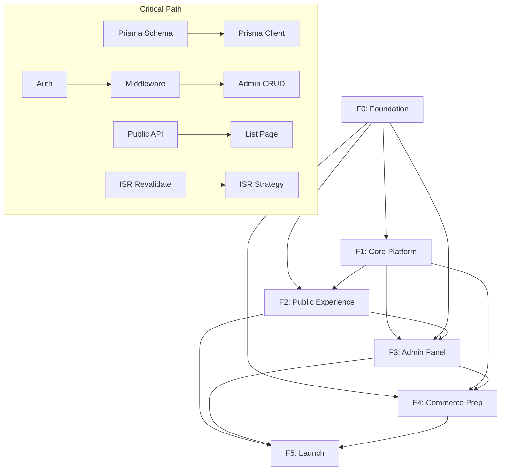

# Roadmap جامع و حرفه‌ای — Premium Next.js Boilerplate برای منوی کافه‌رستوران

> **نسخه:** 1.0.0  
> **تاریخ:** ۱۷ تیر ۱۴۰۵ (۱۷ جولای ۲۰۲۶)  
> **وضعیت:** MVP — منوی دیجیتال + پنل ادمین  
> **مدت تخمینی MVP:** ۱۰–۱۲ هفته (با تیم ۱–۲ نفر)

---

## فهرست مطالب

1. [خلاصه اجرایی](#1-خلاصه-اجرایی)
2. [Benchmarking و تحلیل رقبا](#2-benchmarking-و-تحلیل-رقبا)
3. [استراتژی معماری و اصول فنی](#3-استراتژی-معماری-و-اصول-فنی)
4. [Roadmap فازبندی‌شده](#4-roadmap-فازبندی‌شده)
5. [Dependency Map (نقشه وابستگی)](#5-dependency-map-نقشه-وابستگی)
6. [Risk Register و Mitigation](#6-risk-register-و-mitigation)
7. [Timeline و Milestones](#7-timeline-و-milestones)
8. [معیارهای موفقیت (KPIs)](#8-معیارهای-موفقیت-kpis)
9. [Backlog آینده (Post-MVP)](#9-backlog-آینده-post-mvp)

---

## 1. خلاصه اجرایی

### 1.1 هدف پروژه

ایجاد یک **Boilerplate Premium و Sale-Ready** برای منوی دیجیتال کافه‌رستوران با:

- تجربه عمومی مدرن (Home, About, List, Product Detail)
- پنل ادمین حرفه‌ای برای مدیریت محتوا
- معماری **Future-Ready** برای سفارش‌گیری، سبد خرید، پرداخت آنلاین (زرین‌پال و…) و RBAC پیشرفته

### 1.2 Scope فاز MVP

| در Scope MVP | خارج از Scope MVP |
|---|---|
| منوی دیجیتال responsive | پرداخت آنلاین واقعی |
| پنل ادمین (نقش Admin) | سبد خرید و Checkout کامل |
| Dark/Light mode | OTP و Social Login |
| SEO + Performance | RBAC چندنقشی کامل |
| Prisma Schema آماده Order/Cart/Payment/Role | POS Integration |
| Auth با email/mobile + password | Multi-tenant SaaS |

### 1.3 Stack تکنولوژی (تثبیت‌شده)

| لایه | تکنولوژی | نسخه/یادداشت |
|---|---|---|
| Framework | Next.js (App Router) | 16.x + React Compiler |
| Language | TypeScript | Strict Mode |
| Styling | Tailwind CSS | v4 — token-based |
| Database | MongoDB + Prisma ORM | 7.x |
| State | Zustand | UI + Auth |
| HTTP | Axios | API abstraction |
| UI | shadcn/ui + Radix UI | Accessible primitives |
| Auth | JWT (MVP) → Auth.js (فاز بعد) | email/mobile + password |
| Media | Cloudinary (پیش‌فرض) / S3 | extensible adapter |
| Font | Vazirmatn (وزیر) | RTL-first |

---

## 2. Benchmarking و تحلیل رقبا

### 2.1 محصولات مرجع (Digital Menu)

| محصول | نقاط قوت | نقاط ضعف | درس برای ما |
|---|---|---|---|
| **TableQR** | برندینگ قوی، UX موبایل تمیز، view-only سریع | بدون ordering در لایه پایه | تمرکز روی brand-first mobile UX |
| **Menuo** | آپدیت لحظه‌ای، CDN، فیلتر و چندزبانه | SaaS بسته، customization محدود | ISR + instant content refresh |
| **iMenuPro** | کنترل طراحی بالا، QR بدون اپ | ordering ضعیف | design tokens + template extensibility |
| **Menued** | AI import، subdomain branding | vendor lock-in | seed data + admin onboarding UX |
| **Menyo** | AI menu scan، analytics، multi-location | پیچیدگی بالا برای MVP | analytics foundation در schema |

### 2.2 محصولات مرجع (Technical / Boilerplate)

| مرجع | Stack | درس برای ما |
|---|---|---|
| **Dineflow** (GitHub) | Next.js 16, Prisma, Tailwind v4, Zustand | ساختار admin CRUD + order models |
| **Foodie** (GitHub) | Next.js 16, MongoDB, shadcn/ui | UX delivery-app style + admin analytics |
| **Linear / Vercel Dashboard** | — | sidebar admin، permission-based nav |
| **Shopify Storefront** | — | product card patterns، category hierarchy |

### 2.3 الگوهای UX برتر (استخراج‌شده)

1. **Scan → Browse → Detail** در کمتر از ۳ ثانیه (LCP)
2. **دسته‌بندی sticky** + جستجوی inline در صفحه List
3. **تصاویر بزرگ** با lazy loading و placeholder blur
4. **بدون نیاز به ثبت‌نام** برای مشاهده منو (MVP)
5. **آپدیت لحظه‌ای** قیمت/موجودی از پنل ادمین (ISR revalidation)
6. **Dark mode** بدون flicker (next-themes + CSS variables)

### 2.4 Positioning محصول ما

```
Premium Boilerplate = TableQR UX + Dineflow Architecture + Iranian Payment Readiness
```

---

## 3. استراتژی معماری و اصول فنی

### 3.1 ساختار پوشه‌ها

```
src/
├── app/                  # App Router (pages + API routes)
│   ├── (public)/         # Home, About, List, Product
│   ├── admin/            # Protected admin panel
│   └── api/              # Route handlers
├── components/
│   ├── ui/               # shadcn primitives
│   └── ...               # domain components
├── lib/                  # auth, http, env, utils
├── server/               # prisma, services
├── store/                # zustand stores
├── types/                # shared TypeScript types
├── data/                 # seed/static fallback data
└── hooks/                # custom React hooks
```

### 3.2 Rendering Strategy (تثبیت per-page)

| صفحه | Strategy | Revalidate | دلیل |
|---|---|---|---|
| Home | SSG + ISR | 3600s | محتوای semi-static |
| About | SSG | — | rarely changes |
| List | ISR | 300s | menu updates frequent |
| Product Detail | ISR | 300s | price/availability changes |
| Admin (all) | CSR + SSR shell | — | auth-protected, interactive |
| Search/Filter | CSR (client) | — | interactive UX |

### 3.3 Design System Tokens

```css
/* Brand Palette */
--color-brand-primary:   #2f6b4f;  /* سبز درباری */
--color-brand-secondary: #8b233d;  /* زرشکی */
--color-brand-accent:    #f4e3b2;  /* کرم روشن */
--color-brand-surface:   #faf8f4;  /* پس‌زمینه روشن */
--color-brand-dark:      #1a1f1c;  /* پس‌زمینه تاریک */
```

---

## 4. Roadmap فازبندی‌شده

---

### فاز ۰ — Discovery & Foundation
**هدف:** تثبیت scope، معماری، scaffold و design system پایه

#### Tasks

| ID | Task | Owner | وابستگی | Deliverable |
|---|---|---|---|---|
| F0-T01 | تعریف MVP scope و Non-Goals | PM/Dev | — | Scope document (PRD §2) |
| F0-T02 | Benchmarking رقبا و UX patterns | PM/Design | F0-T01 | Benchmark report (§2) |
| F0-T03 | Scaffold پروژه Next.js 16 + TS strict | Dev | — | `package.json`, `tsconfig.json` |
| F0-T04 | تنظیم Tailwind v4 + design tokens | Dev/Design | F0-T03 | `globals.css`, tokens |
| F0-T05 | راه‌اندازی ESLint + Prettier | Dev | F0-T03 | `eslint.config.mjs` |
| F0-T06 | تنظیم Prisma + MongoDB connection | Dev | F0-T03 | `prisma/schema.prisma`, `.env.example` |
| F0-T07 | طراحی Prisma models پایه (User, Role, Menu, Order, Cart, Payment) | Dev | F0-T06 | Schema v1 |
| F0-T08 | Seed script و sample data | Dev | F0-T07 | `prisma/seed.ts` |
| F0-T09 | فونت Vazirmatn + RTL layout base | Dev/Design | F0-T04 | `layout.tsx` |
| F0-T10 | CI pipeline اولیه (lint + typecheck + build) | DevOps | F0-T03 | GitHub Actions |
| F0-T11 | مستندسازی ROADMAP + PRD | PM | F0-T01, F0-T02 | `ROADMAP.md`, `PRD.md` |

#### Technical Requirements

- Node.js ≥ 18
- MongoDB Atlas یا local replica set
- TypeScript `strict: true`
- React Compiler enabled در `next.config.ts`
- Environment variables validated با Zod (`src/lib/env.ts`)

#### Risks & Mitigation

| Risk | Impact | Probability | Mitigation |
|---|---|---|---|
| Scope creep | بالا | متوسط | PRD با Non-Goals صریح |
| MongoDB بدون replica set | متوسط | پایین | مستندسازی requirement |
| Tailwind v4 breaking changes | متوسط | پایین | مراجعه به docs داخلی Next.js 16 |

#### Acceptance Criteria

- [ ] `npm run build` بدون error
- [ ] Prisma schema push موفق
- [ ] Design tokens در light/dark کار می‌کند
- [ ] ROADMAP و PRD تأیید stakeholder

---

### فاز ۱ — Core Platform Foundation
**هدف:** زیرساخت فنی مشترک برای public و admin

#### Tasks

| ID | Task | Owner | وابستگی | Deliverable |
|---|---|---|---|---|
| F1-T01 | App Router structure (layouts, error, loading, not-found) | Dev | F0-T03 | `src/app/*` |
| F1-T02 | Theme Provider (next-themes) + toggle | Dev | F0-T04, F0-T09 | `theme-provider.tsx`, `theme-toggle.tsx` |
| F1-T03 | UI primitives (Button, Card, Input, Label, …) | Dev | F0-T04 | `src/components/ui/*` |
| F1-T04 | Site header + navigation shell | Dev | F1-T03 | `site-header.tsx` |
| F1-T05 | Auth system: JWT + bcrypt password hash | Dev | F0-T07 | `src/lib/auth.ts` |
| F1-T06 | Login API route + validation (Zod) | Dev | F1-T05 | `api/auth/login/route.ts` |
| F1-T07 | Middleware: protected admin routes | Dev | F1-T05 | `src/middleware.ts` |
| F1-T08 | Zustand stores (auth + UI) | Dev | F1-T05 | `src/store/*` |
| F1-T09 | Axios HTTP client + interceptors | Dev | F1-T05 | `src/lib/http.ts` |
| F1-T10 | Prisma client singleton | Dev | F0-T06 | `src/server/prisma.ts` |
| F1-T11 | Role seed (Admin) + default admin user | Dev | F0-T08 | seed data |
| F1-T12 | Admin layout shell + sidebar nav | Dev | F1-T03, F1-T07 | `admin/layout.tsx`, `admin-shell.tsx` |
| F1-T13 | Health check API | Dev | F1-T10 | `api/health/route.ts` |
| F1-T14 | Types shared (User, MenuItem, Order, …) | Dev | F0-T07 | `src/types/index.ts` |

#### Technical Requirements

- JWT stored in httpOnly cookie (preferred) یا secure localStorage
- Password: bcrypt cost ≥ 12
- Middleware matcher: `/admin/:path*` (exclude `/admin/login`)
- All API routes: Zod input validation
- Error responses: consistent `{ error, code, details? }` shape

#### Risks & Mitigation

| Risk | Impact | Probability | Mitigation |
|---|---|---|---|
| JWT security flaws | بالا | متوسط | httpOnly cookie + short expiry + refresh token (فاز بعد) |
| Middleware bypass | بالا | پایین | server-side role check در هر admin API |
| Schema drift | متوسط | متوسط | Prisma migrate/push در CI |

#### Acceptance Criteria

- [ ] Admin login/logout کار می‌کند
- [ ] `/admin/*` بدون auth → redirect به login
- [ ] Theme toggle بدون flicker
- [ ] UI components در Storybook یا demo page (optional)

---

### فاز ۲ — Public Experience (منوی دیجیتال)
**هدف:** صفحات عمومی Premium با SEO و performance

#### Tasks

| ID | Task | Owner | وابستگی | Deliverable |
|---|---|---|---|---|
| F2-T01 | Home page: Hero, featured items, CTA | Dev/Design | F1-T03, F1-T04 | `src/app/page.tsx` |
| F2-T02 | About Us page | Dev/Design | F1-T03 | `src/app/about/page.tsx` |
| F2-T03 | Menu List: categories, grid, filter | Dev | F1-T10, F1-T03 | `src/app/list/page.tsx` |
| F2-T04 | Product Detail: images, price, tags, meta | Dev | F1-T10 | `src/app/product/[slug]/page.tsx` |
| F2-T05 | Public API: GET categories, items, item by slug | Dev | F1-T10 | `api/menu/*` |
| F2-T06 | SEO: metadata, OG, JSON-LD (MenuItem) | Dev | F2-T01–T04 | metadata exports |
| F2-T07 | Image optimization (next/image + Cloudinary) | Dev | F0-T06 | image config |
| F2-T08 | Search/filter (client-side CSR) | Dev | F2-T03 | filter component |
| F2-T09 | Responsive: mobile-first breakpoints | Design/Dev | F2-T01–T04 | responsive QA |
| F2-T10 | ISR revalidation strategy | Dev | F2-T05 | `revalidate` config |
| F2-T11 | 404 page (public) | Dev | F1-T01 | `not-found.tsx` |
| F2-T12 | Accessibility audit (WCAG 2.1 AA) | QA | F2-T01–T04 | a11y checklist |

#### Technical Requirements

- LCP target: < 2.5s (mobile 4G)
- Images: WebP/AVIF, sizes attribute, priority for hero
- Metadata: dynamic `generateMetadata` for product pages
- Structured data: `Restaurant` + `MenuItem` schema.org
- Font: Vazirmatn with `display: swap`

#### Risks & Mitigation

| Risk | Impact | Probability | Mitigation |
|---|---|---|---|
| Heavy images slow LCP | بالا | بالا | Cloudinary transforms + blur placeholder |
| Stale menu data | متوسط | متوسط | ISR 300s + on-demand revalidate from admin |
| RTL layout bugs | متوسط | متوسط | logical properties (`ms-`, `me-`, `start`, `end`) |

#### Acceptance Criteria

- [ ] ۴ صفحه public کامل و responsive
- [ ] Lighthouse Performance ≥ 90
- [ ] SEO score ≥ 90
- [ ] Dark/Light mode در همه صفحات
- [ ] داده از DB (نه فقط static mock)

---

### فاز ۳ — Admin Panel MVP
**هدف:** پنل مدیریت محتوا برای Admin

#### Tasks

| ID | Task | Owner | وابستگی | Deliverable |
|---|---|---|---|---|
| F3-T01 | Admin Dashboard: stats overview | Dev | F1-T12 | `admin/page.tsx` |
| F3-T02 | Menu Items CRUD (list, create, edit, delete) | Dev | F1-T10, F1-T07 | `admin/menu/page.tsx` + API |
| F3-T03 | Categories CRUD | Dev | F3-T02 | categories API + UI |
| F3-T04 | Media upload (Cloudinary integration) | Dev | F0-T06 | upload API + UI |
| F3-T05 | Settings page (brand colors, contact, logo) | Dev | F1-T10 | `admin/settings/page.tsx` |
| F3-T06 | Users management (list, create Admin) | Dev | F1-T11 | `admin/users/page.tsx` |
| F3-T07 | Orders page (read-only preview) | Dev | F0-T07 | `admin/orders/page.tsx` |
| F3-T08 | Form validation (react-hook-form + Zod) | Dev | F3-T02–T06 | form schemas |
| F3-T09 | Toast notifications (success/error) | Dev | F1-T03 | toast component |
| F3-T10 | Audit log for admin actions | Dev | F0-T07 | audit on CRUD |
| F3-T11 | On-demand ISR revalidation after content change | Dev | F2-T10 | revalidate API |
| F3-T12 | Admin error/loading states | Dev | F1-T01 | `admin/error.tsx`, `loading.tsx` |

#### Technical Requirements

- All admin mutations: server-side role check (`Admin`)
- Optimistic UI optional; controlled forms mandatory
- File upload: max 5MB, types: jpg/png/webp
- Slug auto-generation from name (Persian → latin slug)
- Soft delete preferred over hard delete for menu items

#### Risks & Mitigation

| Risk | Impact | Probability | Mitigation |
|---|---|---|---|
| Over-complex admin UX | متوسط | بالا | MVP-first: CRUD ساده، بدون drag-drop |
| Upload failures | متوسط | متوسط | retry + error toast + fallback URL input |
| Accidental data loss | بالا | پایین | confirmation dialogs + soft delete |

#### Acceptance Criteria

- [ ] Admin می‌تواند item/category/settings را CRUD کند
- [ ] Upload تصویر کار می‌کند
- [ ] تغییرات در public pages ظاهر می‌شود (ISR)
- [ ] Audit log ثبت می‌شود

---

### فاز ۴ — Commerce Layer Preparation
**هدف:** زیرساخت آماده برای Cart, Order, Payment (بدون UI کامل)

#### Tasks

| ID | Task | Owner | وابستگی | Deliverable |
|---|---|---|---|---|
| F4-T01 | تکمیل Prisma: OrderItem, CartItem models | Dev | F0-T07 | schema v2 |
| F4-T02 | Order status enum + lifecycle design | Dev | F4-T01 | status constants |
| F4-T03 | Payment abstraction interface | Dev | F4-T01 | `src/server/payment/types.ts` |
| F4-T04 | Zarinpal adapter (stub/sandbox) | Dev | F4-T03 | `zarinpal.adapter.ts` |
| F4-T05 | Order API (draft create, list) | Dev | F4-T01 | `api/orders/*` |
| F4-T06 | Cart API (draft add/remove) | Dev | F4-T01 | `api/cart/*` |
| F4-T07 | Payment callback route (stub) | Dev | F4-T04 | `api/payments/callback` |
| F4-T08 | Iranian gateway fields in schema | Dev | F4-T01 | authority, refId, gatewayStatus |
| F4-T09 | Zustand cart store (draft) | Dev | F4-T06 | `cart-store.ts` |
| F4-T10 | Documentation: payment integration guide | Dev | F4-T04 | docs in PRD |

#### Payment Fields (Iranian Gateways)

```
Order/Payment shared fields:
├── authority      # 36-char Zarinpal authority
├── refId          # tracking code after verify
├── gatewayStatus  # OK | NOK (callback Status param)
├── paymentStatus  # pending | paid | failed | refunded
├── gateway        # zarinpal | idpay | sep | ...
├── callbackUrl    # return URL after payment
├── amount         # in IRR (minimum 10000)
└── currency       # IRR | IRT
```

#### Technical Requirements

- Payment adapter pattern: `PaymentProvider` interface
- Idempotent payment verify (prevent double-charge)
- Order totals calculated server-side (never trust client)
- Cart stored in DB for logged-in users; session/localStorage for guests (future)

#### Risks & Mitigation

| Risk | Impact | Probability | Mitigation |
|---|---|---|---|
| Premature payment coupling | متوسط | متوسط | adapter interface + stub implementation |
| Currency confusion (IRR vs IRT) | متوسط | بالا | single source: store in IRR, display helper |
| Double payment verify | بالا | پایین | idempotency key on verify endpoint |

#### Acceptance Criteria

- [ ] Schema v2 deployed
- [ ] Order/Cart API returns valid responses (stub data OK)
- [ ] Payment adapter interface documented
- [ ] Callback route handles authority + status params

---

### فاز ۵ — Quality, Security & Launch Readiness
**هدف:** Production-ready deployment

#### Tasks

| ID | Task | Owner | وابستگی | Deliverable |
|---|---|---|---|---|
| F5-T01 | Security headers (CSP, HSTS, X-Frame-Options) | DevOps | F1–F4 | `next.config.ts` headers |
| F5-T02 | Rate limiting on auth + API routes | Dev | F1-T06 | middleware/rate-limit |
| F5-T03 | Input sanitization audit | Dev | F3-T02–T06 | security checklist |
| F5-T04 | Performance audit (Lighthouse CI) | QA | F2-T01–T04 | perf report |
| F5-T05 | Accessibility audit (axe) | QA | F2-T12 | a11y report |
| F5-T06 | SEO audit (sitemap, robots.txt) | Dev | F2-T06 | `sitemap.ts`, `robots.ts` |
| F5-T07 | Error monitoring setup (Sentry optional) | DevOps | — | env config |
| F5-T08 | Staging environment + smoke tests | DevOps | F5-T01 | staging URL |
| F5-T09 | Production deployment (Vercel/Docker) | DevOps | F5-T08 | live URL |
| F5-T10 | README + deployment guide | Dev | F5-T09 | `README.md` |
| F5-T11 | Database backup strategy | DevOps | F0-T06 | backup docs |
| F5-T12 | Final QA regression pass | QA | F5-T08 | QA sign-off |

#### Technical Requirements

- HTTPS only in production
- Secrets in env vars (never committed)
- `robots.txt`: disallow `/admin`
- Sitemap: public pages only
- Backup: MongoDB Atlas automated backups

#### Risks & Mitigation

| Risk | Impact | Probability | Mitigation |
|---|---|---|---|
| Production env misconfiguration | بالا | متوسط | `.env.example` + validation |
| Performance regression | متوسط | متوسط | Lighthouse CI in pipeline |
| Missing error handling | متوسط | متوسط | global error boundaries |

#### Acceptance Criteria

- [ ] Lighthouse all categories ≥ 90
- [ ] Security headers verified
- [ ] Staging smoke tests pass
- [ ] Production deployed and accessible
- [ ] README complete

---

## 5. Dependency Map (نقشه وابستگی)



### وابستگی‌های کلیدی (Task-level)

| Task | Blocked By | Blocks |
|---|---|---|
| F1-T07 Middleware | F1-T05 Auth | F3-T02 Admin CRUD |
| F2-T03 List Page | F2-T05 Public API, F1-T03 UI | F2-T08 Search |
| F3-T02 Menu CRUD | F1-T10 Prisma, F1-T07 Middleware | F3-T11 Revalidate |
| F3-T11 Revalidate | F2-T10 ISR | Public content freshness |
| F4-T04 Zarinpal Adapter | F4-T03 Payment Interface | F4-T07 Callback |
| F5-T09 Deploy | F5-T08 Staging | Launch |

---

## 6. Risk Register و Mitigation

| ID | Risk | Phase | Impact | Prob. | Mitigation | Owner |
|---|---|---|---|---|---|---|
| R01 | Scope creep | All | 🔴 High | Medium | PRD Non-Goals + change control | PM |
| R02 | Auth security breach | F1, F5 | 🔴 High | Low | httpOnly JWT, bcrypt, rate limit | Dev |
| R03 | Slow mobile performance | F2, F5 | 🔴 High | Medium | ISR, image opt, code split | Dev |
| R04 | MongoDB connection issues | F0, F5 | 🟡 Med | Low | Atlas + connection pooling | DevOps |
| R05 | Payment gateway coupling | F4 | 🟡 Med | Medium | Adapter pattern | Dev |
| R06 | RTL/i18n bugs | F2 | 🟡 Med | Medium | Logical CSS, Vazirmatn | Dev |
| R07 | Incomplete RBAC | F3 | 🟡 Med | Low | Role model from day 1 | Dev |
| R08 | Stale content after admin edit | F3 | 🟡 Med | Medium | on-demand revalidate | Dev |
| R09 | Cloudinary cost/overages | F3 | 🟢 Low | Low | size limits, compression | Dev |
| R10 | Team bandwidth | All | 🟡 Med | Medium | phased delivery, MVP focus | PM |

---

## 7. Timeline و Milestones

```
Week 1  ████ F0: Foundation + Docs
Week 2  ████ F1: Core Platform (part 1)
Week 3  ████ F1: Core Platform (part 2)
Week 4  ████ F2: Public Experience (part 1)
Week 5  ████ F2: Public Experience (part 2)
Week 6  ████ F3: Admin Panel (part 1)
Week 7  ████ F3: Admin Panel (part 2)
Week 8  ████ F4: Commerce Prep (part 1)
Week 9  ████ F4: Commerce Prep (part 2)
Week 10 ████ F5: Launch Readiness
```

### Milestones

| Milestone | Week | Deliverable |
|---|---|---|
| M0: Docs Approved | 1 | ROADMAP + PRD signed off |
| M1: Platform Ready | 3 | Auth + Theme + UI + Admin shell |
| M2: Public Live | 5 | 4 public pages + SEO |
| M3: Admin Functional | 7 | Full CRUD + upload + settings |
| M4: Commerce Ready | 9 | Order/Cart/Payment schema + stubs |
| M5: Production Launch | 10 | Deployed + documented |

---

## 8. معیارهای موفقیت (KPIs)

### MVP Launch KPIs

| Metric | Target | Tool |
|---|---|---|
| Lighthouse Performance | ≥ 90 | Lighthouse CI |
| Lighthouse SEO | ≥ 90 | Lighthouse CI |
| Lighthouse Accessibility | ≥ 90 | axe / Lighthouse |
| LCP (mobile) | < 2.5s | Web Vitals |
| CLS | < 0.1 | Web Vitals |
| INP | < 200ms | Web Vitals |
| Admin CRUD success rate | 100% | Manual QA |
| Build time | < 3 min | CI |
| Zero critical security issues | 0 | Security audit |

### Post-Launch KPIs (Future)

| Metric | Target |
|---|---|
| Menu page bounce rate | < 40% |
| Avg. time on menu | > 2 min |
| Admin content update time | < 30s per item |
| Payment success rate | > 95% |

---

## 9. Backlog آینده (Post-MVP)

### فاز ۶ — Cart & Checkout UI (هفته ۱۱–۱۳)
- Cart drawer/page
- Guest checkout flow
- Order confirmation page
- Real-time order status

### فاز ۷ — Payment Integration (هفته ۱۴–۱۶)
- Zarinpal sandbox → production
- IDPay adapter
- Payment webhook handling
- Refund flow

### فاز ۸ — Advanced RBAC (هفته ۱۷–۱۸)
- SuperAdmin, Manager, Staff roles
- Permission matrix
- Route-level + action-level guards

### فاز ۹ — Analytics & Multi-location (هفته ۱۹–۲۱)
- Menu view analytics
- Popular items dashboard
- Multi-branch support
- QR code generator

### فاز ۱۰ — SaaS & White-label (هفته ۲۲+)
- Multi-tenant architecture
- Custom subdomain per restaurant
- Subscription billing
- Template marketplace

---

> **گام بعدی:** پس از تأیید این Roadmap و PRD، پیاده‌سازی از **فاز ۰** (در صورت نیاز) یا **فاز ۱** (با توجه به scaffold موجود) آغاز می‌شود.
